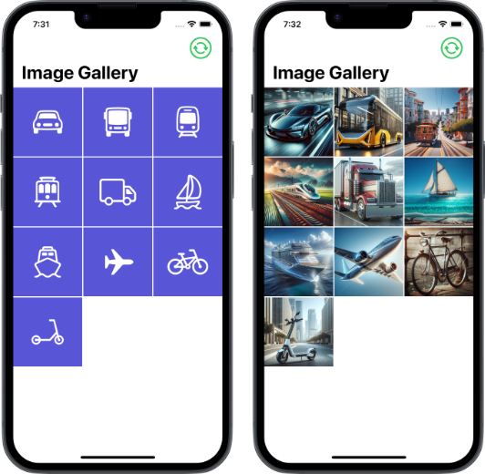

# swiftui-image-gallery

Example of a grid, with square images, using SwiftUI. Toggle the images between SF Symbols and photos. The photos were generated with [DALL-E 3](https://openai.com/index/dall-e-3/).

